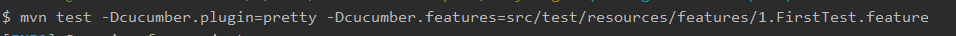
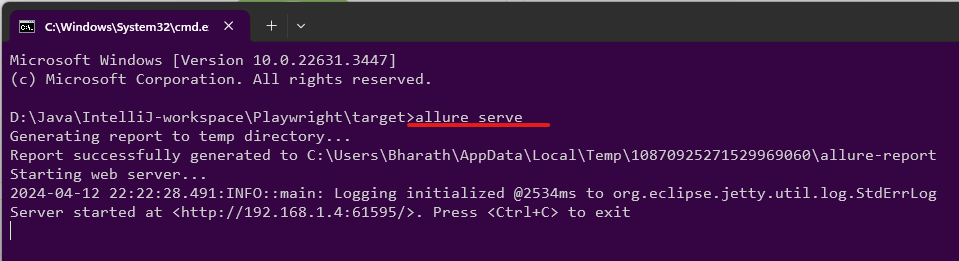
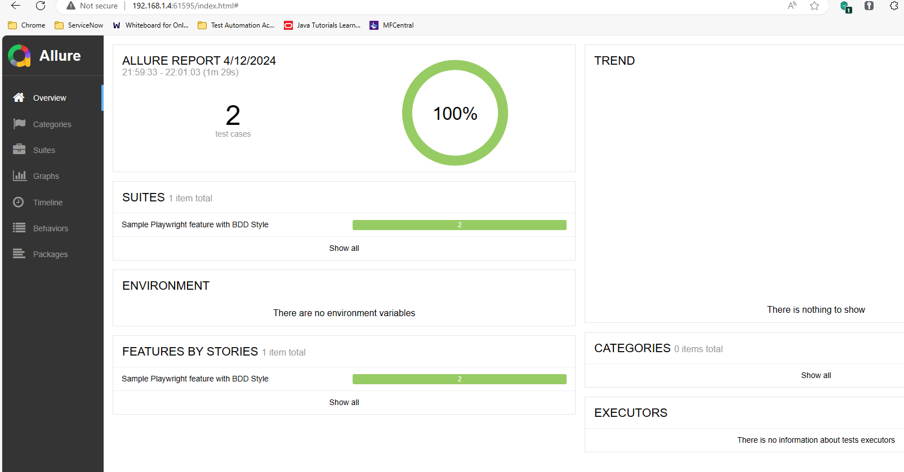

# Playwright Cucucumber

E2E testing using Playwright and Cucucumber


## Tech Stack

**Programming Language:** Java 21

**Libraries:** Playwright, Cucumber, Allure


## Documentation

[Playwright](https://playwright.dev/java/docs/api/class-playwright)

[Cucumber 7](https://cucumber.io/docs/installation/java/)

[Allure Testng](https://allurereport.org/docs/testng/)

[Allure CucumberJVM7](https://allurereport.org/docs/cucumberjvm/)

[Cucumber CLI](https://cucumber.io/docs/cucumber/api/?lang=java#running-cucumber)


## Installation

Install Playwright project with maven

```bash
  mvn clean compile
```

## Running Tests

To run tests, run the following command

```bash
  mvn test
```

To run single feature
```bash
 mvn test -Dcucumber.plugin=pretty -Dcucumber.features=src/test/resources/features/1.FirstTest.feature
 ```

To run with tags
 ```
  mvn test -Dcucumber.filter.tags="@E2E"
 ```

Refer [Running Subset](https://cucumber.io/docs/cucumber/api/?lang=java#running-a-subset-of-scenarios)

## To Run Reports

[Install Allure Commanline](https://allurereport.org/docs/gettingstarted-installation/)


#### Make sure Java version 8 or above installed, and its directory is specified in the JAVA_HOME environment variable.

#### Go to the latest Allure Report release on GitHub and download the allure-*.zip or allure-*.tgz archive.

#### Uncompress the archive into any directory. The Allure Report can now be run using the bin/allure or bin/allure.bat script, depending on the operating system.

#### Note that with this installation method, the commands for running Allure Report must contain with the full path to the script, for example:


```bash
  D:\Tools\allure-2.24.0\bin\allure.bat serve
```

Go to the Report Generated Folder

```bash
  cd/target/allure-results
```

Start the server

```bash
  allure serve
```



